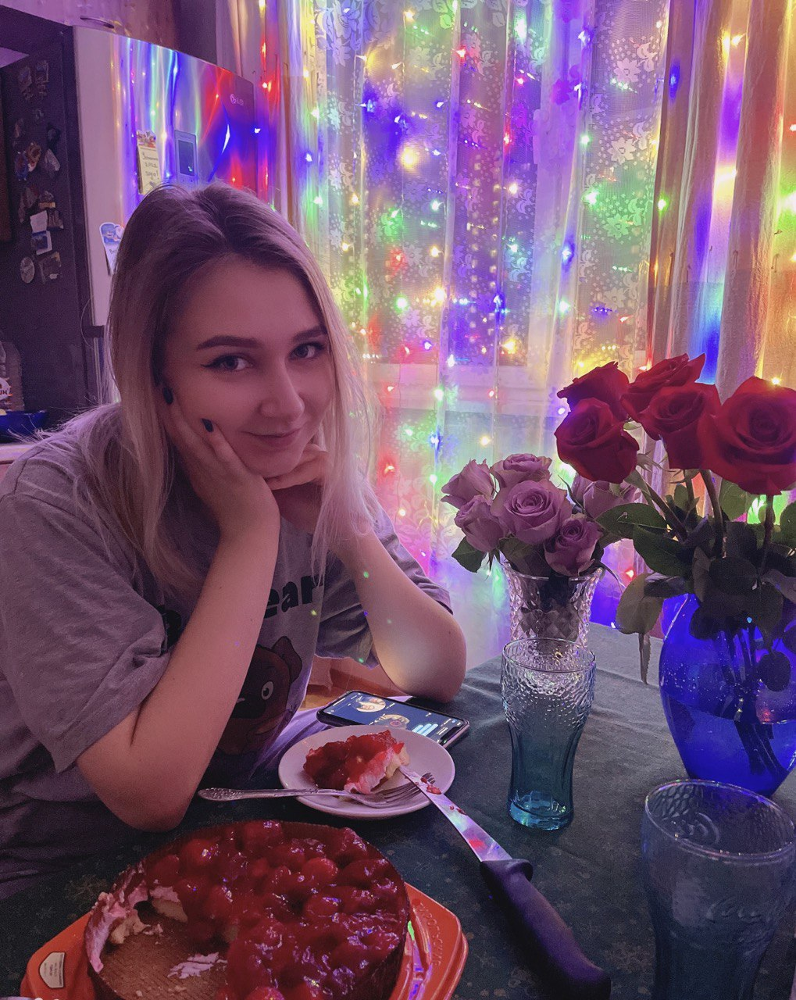

#Kuranova Yulia
##
##Contacts
*Github - [JuliaKuranova](https://github.com/JuliaKuranova)
*Discord - ololo573#5929
*Telegram - @y_klmn
*email - y.kuranova2012@yandex.ru
*Location: Moscow
##About me
###At the moment I am engaged in independent study of materials from open sources and courses on the Internet (JavaScript / React).
##Skills
*HTML
*CSS/Sass
*JavaScript
*Figma
*GitHub
##Code example
###Task from [Leetcode](https://leetcode.com/problems/count-odd-numbers-in-an-interval-range/)
```javascript
/**
 * @param {number} low
 * @param {number} high
 * @return {number}
 */
var countOdds = function(low, high) {
    let countOfAdd = 0;
    for (let i = low; i <= high; i++) {
        if (i % 2 !== 0) {
           countOfAdd++
        }
    }
    return countOfAdd
};
```
##Experience
###I have been working as a layout designer for 1 year
###My work site - https://www.mcn.ru/
##Education
*FreeCodeCamp [Responsive Web Design Certification] (https://www.freecodecamp.org/learn/2022/responsive-web-design/)
*FreeCodeCamp [JavaScript Algorithms and Data Structures] (https://www.freecodecamp.org/learn/javascript-algorithms-and-data-structures/)
##Languages
*Russian: native
*English: A2


